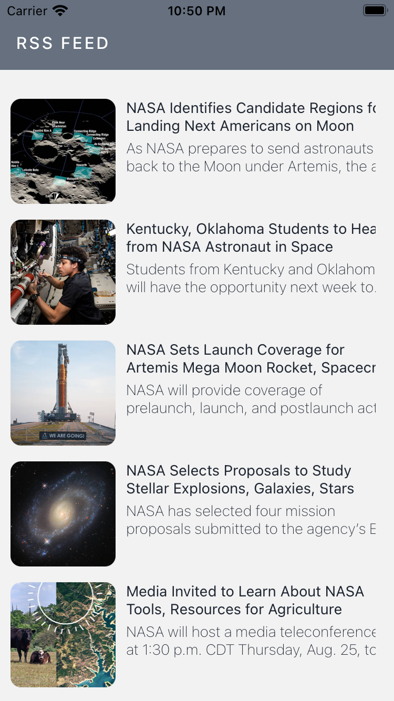
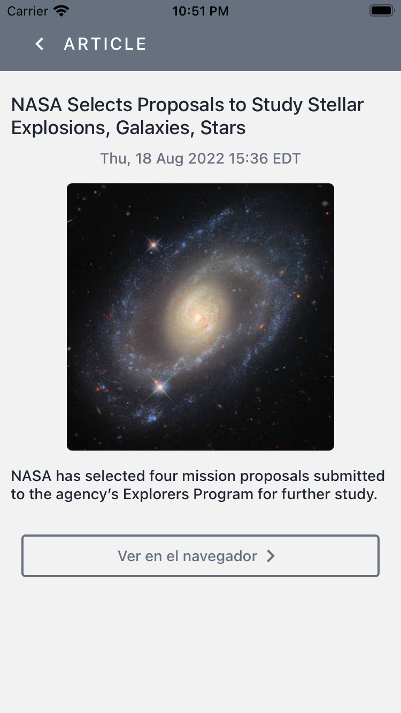

# RSS Reader App

  <!-- iOS -->
  
  <!-- Android -->
  

<header>
    
This project serves as a mobile app for reading NASA's RSS breaking news feed. Created for testing purposes.

</header>

<section>
    <h4>Utilizes:</h4>
    <ul>
        <li>React Native</li>
        <Li>Expo cli</li>
        <li>TypeScript</li>
        <Li>Styled components</li>
        <Li>Atomic design pattern</li>
        <Li>react-native-rss-parser package to parse fetched rss data & get Typescript RSS types</li>
    </ul>
</section>

<section style="margin: 20px;">
    <h4>To Run Project:</h4>
    
git clone project via preferred method

    <code>
        yarn;
        expo start
    </code>
    
Scan QR code in terminal to run on physical device (via the expo app. you should have this app downloaded) <b>or</b> follow instructions in terminal to run on computer's Android or iOS simulator

</section>

<section style="display: flex; margin: 20px;">
    
     
</section>
